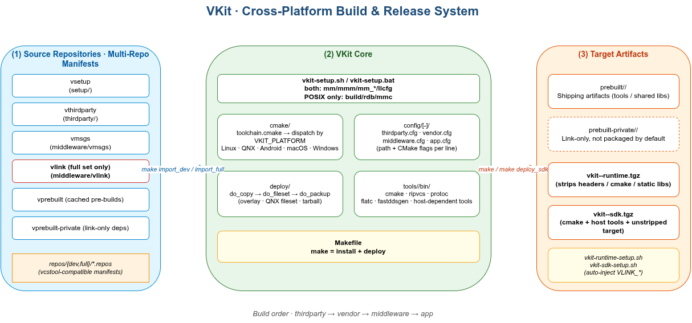
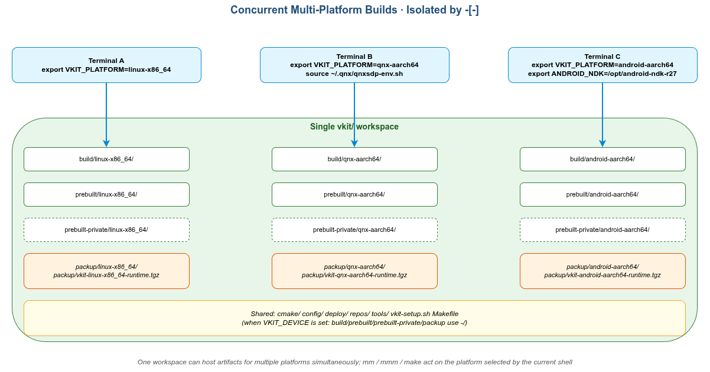
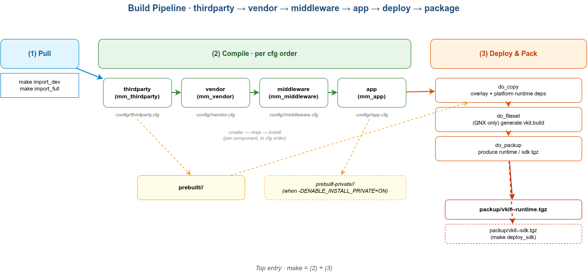
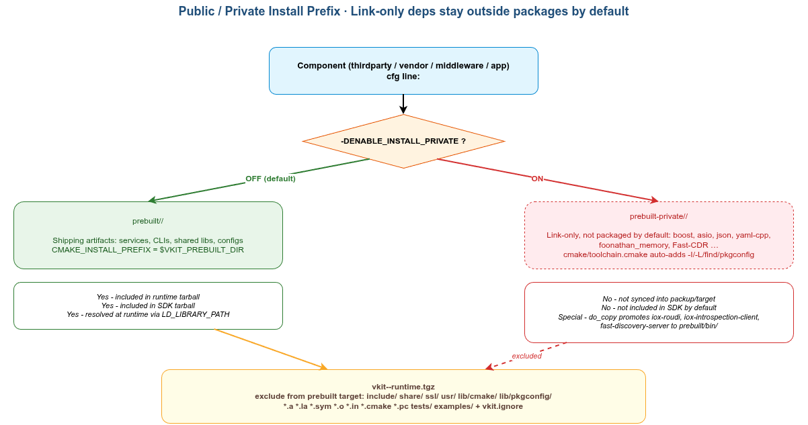
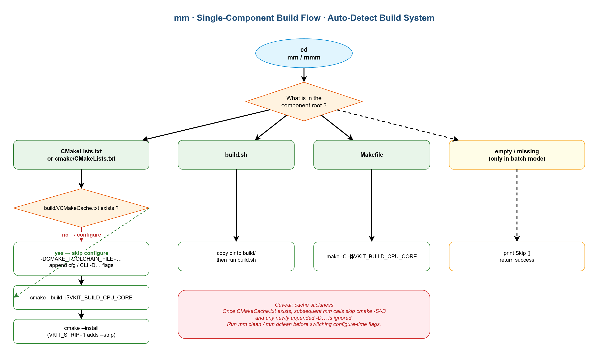
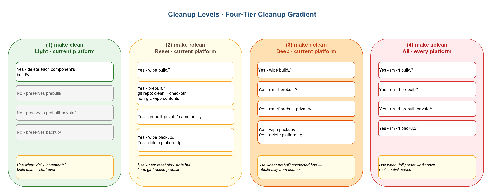
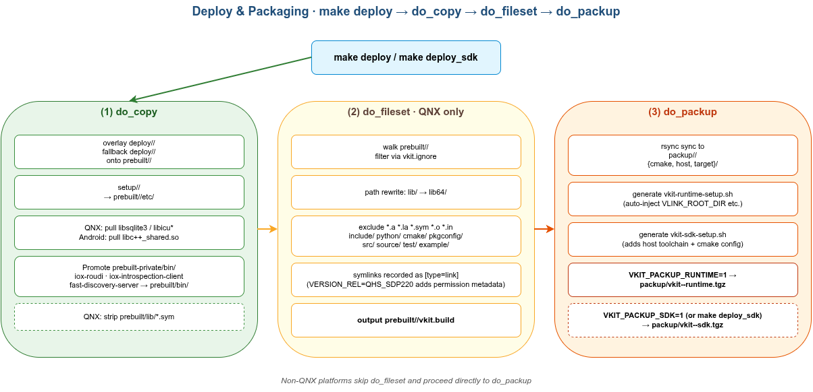
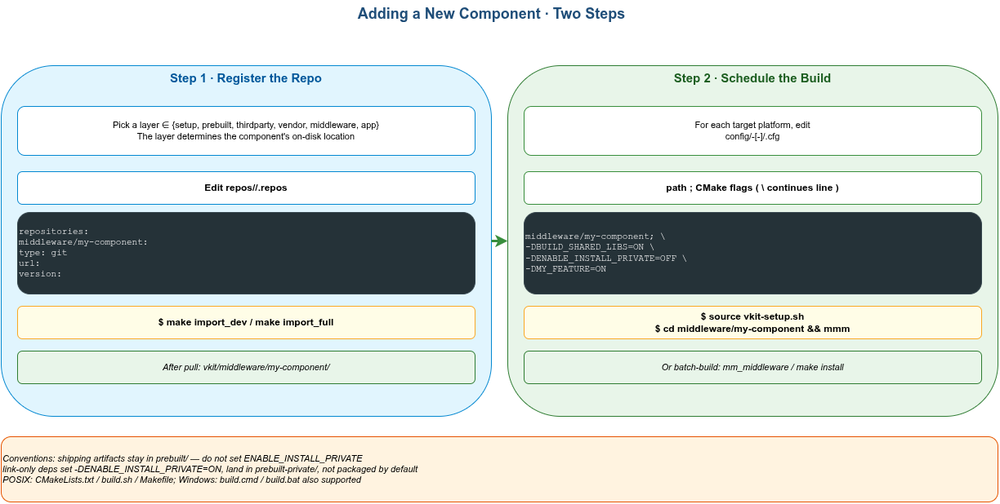
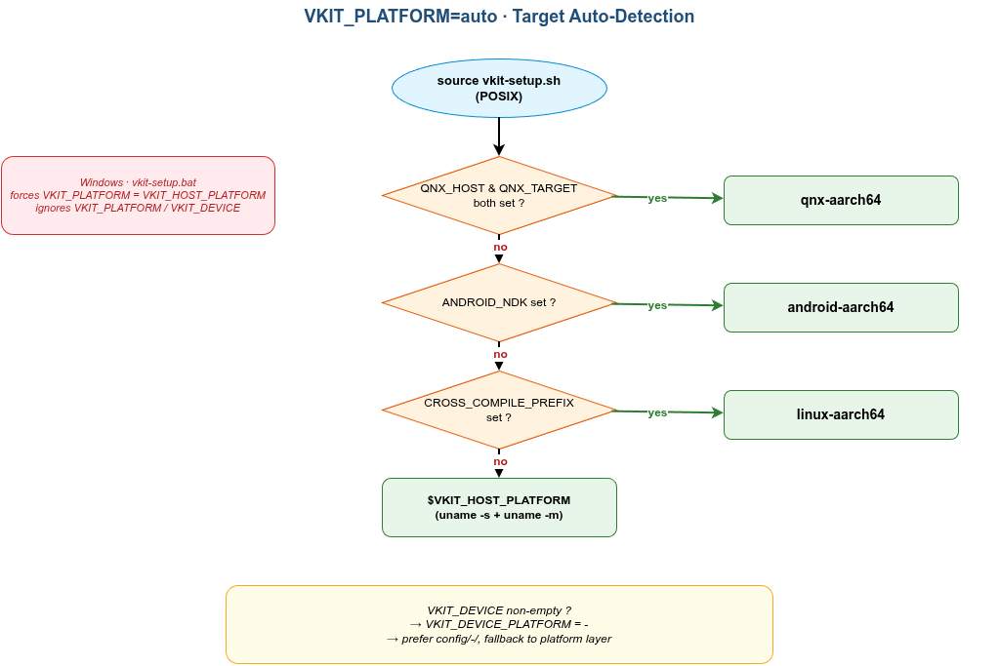

<h1 align="center">VKit</h1>

<p align="center"><strong>面向 <a href="https://vlink.work">VLink</a> 工程的跨平台构建与发布套件</strong></p>

<p align="center">
  
  
  
  <a href="LICENSE"></a>
</p>

<p align="center"><a href="README.en_us.md">English</a> · 中文 · <a href="CHANGELOG.md">变更日志</a> · <a href="LICENSE">许可证</a></p>

VKit 把多仓库源码拉取、跨平台 CMake 工具链分发、分层组件编排、增量缓存、目标制品组装与 SDK / Runtime 打包**编织成一条命令的端到端流水线**——让 VLink 与其依赖在 Linux / QNX / Android / macOS / Windows 上以**同一套命令、目录结构与产物形态**完成构建与交付。

<p align="center"></p>

---

## 📑 文档导航

| # | 章节 | 适合谁 |
| --- | --- | --- |
| 1 | [🤔 为什么用 VKit](#1--为什么用-vkit) | 第一次接触 |
| 2 | [⚡ 快速开始（10 分钟）](#2--快速开始10-分钟) | 第一次构建 |
| 3 | [🧩 核心概念](#3--核心概念) | 想理解工作原理 |
| 4 | [🛠️ 日常工作流](#4-%EF%B8%8F-日常工作流) | 已开始迭代 |
| 5 | [🚢 部署与发布](#5--部署与发布) | 准备出包 |
| 6 | [➕ 配方（Recipes）](#6--配方recipes) | 任务导向 |
| 7 | [🔍 调试与排查](#7--调试与排查) | 编译失败时 |
| 8 | [🪟 Windows 特化](#8--windows-特化) | Windows 用户 |
| 9 | [❓ FAQ](#9--faq) | 常见疑问 |
| 附录 | [A 平台矩阵](#附录-a--平台支持矩阵) · [B 环境变量](#附录-b--环境变量全集) · [C 部署细节](#附录-c--部署实现细节) · [D 高阶扩展](#附录-d--添加新平台--新架构) | 参考查阅 |

---

## 1. 🤔 为什么用 VKit

把同一套代码稳稳地构建到多个操作系统 × 多个架构上，从来不是裸 CMake 能优雅解决的问题。VKit 在 CMake 之上提供五层杠杆：

| 维度 | 痛点 | VKit 的做法 |
| --- | --- | --- |
| **多平台** | 工具链脚本各写各的、安装前缀和搜索路径不统一 | 一个 `cmake/toolchain.cmake` 统一派发各 `<os>-<arch>` 目标；自动派生 `_INSTALL_PREFIX` |
| **多组件** | 几十个组件的构建顺序、CMake flag 难以维护 | `config/<平台>/{thirdparty,vendor,middleware,app}.cfg`：每行一个组件 + flag |
| **多设备** | 同平台多设备 ECU 配置互相打架 | `VKIT_DEVICE` 叠加层；产物与缓存按 `<平台>-<设备>` 隔离，多设备并行编译互不干扰 |
| **AOSP 体验** | 单组件迭代要记 build 路径、敲长 cmake 命令 | `mm` / `mmm`：进任意组件目录直接编译；自动注入 cfg flag |
| **发布交付** | 编译、剥离、打包、部署脚手架重复造轮子 | `make` 一条命令完成「编译 → overlay 部署 → QNX fileset → SDK / Runtime 双包」 |

### 1.1 与 Conan / Colcon / vcpkg 的取舍

同类工具各有侧重，VKit 选择了一条**紧贴 CMake、面向交付**的路线：

| 维度 | **VKit** | Conan | Colcon (ROS 2) | vcpkg |
| --- | --- | --- | --- | --- |
| 运行时依赖 | **只需 Bash + CMake** | Python ≥ 3.6 + Conan 包 | Python 3 + 一组 `colcon-*` 包 | C++ 引导，port 内部用 CMake |
| CMake 集成 | **原生，组件 `CMakeLists.txt` 不动** | 需写 `conanfile.py/.txt` + `find_package` 包装 | 必须用 `ament_cmake` 等自定义宏 | port 即 vcpkg 的 DSL |
| 学习曲线 | **会 CMake 即可上手** | 需学包描述 DSL + profile | 需学 ament / colcon 约定 | 需学 portfile + triplet |
| 跨平台交叉编译 | **内建** Linux / QNX / Android / macOS / Windows + 多设备叠加层 | profile + 工具链文件，自行拼装 | 主要面向 Linux ROS 2，工具链自行接入 | 内置 triplet，QNX / 嵌入式覆盖较薄 |
| 制品产出 | **一条命令产 runtime + SDK 双包**（含 QNX fileset、Android NDK 兼容） | 输出 Conan 包，发布需另接 | 输出 `install/`，无成品打包 | 输出库目录，无成品打包 |
| 多仓库源码编排 | `.repos` + `ripvcs/vcstool`，**4 层串行** | 不负责拉源码，需自行脚本 | 用 `vcs` 拉 ROS workspace | 不管理上层源码 |
| 设备 / ECU 派生 | **`VKIT_DEVICE` 叠加层**，多套配置共享一份源码 | 用 profile 区分，复杂场景需脚本 | 不直接支持 | triplet 可表达，灵活度有限 |

**几个关键点：**

- **不依赖 Python。** 全流程只用 Bash + CMake；CI 镜像更小，QNX 与嵌入式主机也省去 venv 麻烦。
- **不引入新语法。** 组件保持原生 `CMakeLists.txt` 即可——不必写 Colcon 的 `ament_cmake_xxx` 包装、Conan 的 `conanfile` 或 vcpkg 的 portfile，团队的 CMake 经验直接迁移。
- **面向交付，而非包仓库。** Conan / vcpkg 解决「依赖怎么来」，VKit 解决「VLink 在 5 个 OS × 多设备上如何一键编译、打包、装机」——toolchain 派发、cfg 编排、overlay、剥离、fileset、双包打包串成一条流水线。
- **AOSP 式的单组件迭代。** `mm` / `mmm` 让日常开发不必记 build 路径——这是从包管理器角度切入的工具通常不会做的事。

> 💡 **定位**　VKit 不取代 CMake，也不与 Conan / vcpkg 争「依赖管理」——它是一层 *workspace orchestrator*，为 VLink 这种多仓库、多平台、多设备的中间件场景提供一致的构建 / 部署 / 打包体验。

---

## 2. ⚡ 快速开始（10 分钟）

> 假设你想从零编译 VLink 并产出可部署的 runtime tarball。

### 2.1 主机依赖

推荐 **Ubuntu 22.04**（最低 20.04；macOS / Windows / WSL2 同样支持）。

```bash
sudo apt-get -y install \
    git git-lfs \
    autoconf automake tclsh \
    build-essential ninja-build ccache rsync \
    python3 \
    openjdk-17-jdk \
    doxygen graphviz \
    ccache
sudo pip install vcstool
```

| 工具 | 来源 | 备注 |
| --- | --- | --- |
| `cmake / ripvcs / protoc / flatc / fastddsgen` | **仓库自带**（`tools/<host>/bin/`） | 自动入 `PATH`，无需系统安装 |
| `ninja / ccache / git / git-lfs` | 系统包管理 | ccache 启用后构建提速 5-10× |
| `openjdk-17-jdk` | 系统包管理 | `fastddsgen` 是 Java 程序 |
| Python ≥ 3.6 + `vcstool` | 系统 + pip | 仅在内置 `ripvcs` 不可用时回退使用 |

### 2.2 拉取源码

```bash
git clone <vkit-url> vkit && cd vkit

$EDITOR repos/full/*.repos

make import_full     # 默认推荐：从零编译 vlink
# 或
make import_dev      # 已有 vlink 工作树时的开发者集
```

| 集合 | `middleware.repos` 内容 | 适用场景 |
| --- | --- | --- |
| **`full`** | `vmsgs` + `vlink` | **从零编译 vlink（推荐）** |
| `dev` | `vmsgs` 仅 | 你本地已经放好 `middleware/vlink/`（vlink 开发者） |

> 拉取顺序固定为 `setup → prebuilt(--shallow) → thirdparty(--shallow) → vendor → middleware → app`；shallow 拉取省磁盘。

### 2.3 配置目标平台

各平台只需一步追加配置；其余由 `VKIT_PLATFORM=auto`（默认）自动识别：

```bash
# Linux x86_64（本机）       —— 无需任何额外步骤
# Linux aarch64（交叉编译）  —— export CROSS_COMPILE_PREFIX=/opt/.../bin/aarch64-none-linux-gnu-
# QNX                        —— source ~/.qnx/qnxsdp-env.sh
# Android                    —— export ANDROID_NDK=/opt/android-ndk-r27
```

> 💡 自动识别只能定位到 **aarch64** 交叉目标；`qnx-x86_64` / `android-x86_64` 需 `export VKIT_PLATFORM=...` 显式指定。完整规则见 [附录 A](#附录-a--平台支持矩阵)。
> Windows `vkit-setup.bat` 强制使用主机平台，详见 [§8](#8--windows-特化)。

### 2.4 一键构建

```bash
make                # 编译 → 部署 → 生成 runtime 包
```

`make` 等价于 `make install + make deploy`。完整入口：

| 入口 | 行为 |
| --- | --- |
| `make` | install + deploy（**默认**，产 runtime 包） |
| `make install` | 仅按 cfg 顺序编译 |
| `make deploy` | 仅部署 + runtime 包 |
| `make deploy_sdk` | deploy + 额外产 SDK 包 |
| `make clean` / `rclean` / `dclean` / `aclean` | 四级清理（[§4.4](#44-清理与缓存)） |

### 2.5 验证产物

```bash
ls packup/                                  # vkit-<平台>-runtime.tgz
tar tzf packup/vkit-*-runtime.tgz | head    # 看包内 layout

# 主机平台 + 已 import_full 时，可直接原地试跑
source vkit-setup.sh
vlink-info -v                                # 输出版本号 = 成功
```

> 💡 `vlink-info` 是 vlink 编译产物，仅在 ① 已用 `make import_full` 拉到 vlink 源码、② 当前编译目标 = 主机平台 时可在主机直接调用。交叉编译产物需部署到目标设备运行。

预期目录结构：
```
packup/
├── linux-x86_64/
│   ├── cmake/    host/    target/
│   ├── vkit-sdk-setup.sh                    (SDK 包用)
│   └── target/vkit-runtime-setup.sh         (Runtime 包用)
└── vkit-linux-x86_64-runtime.tgz            ← 部署到目标设备的产物
```

### 2.6 下一步

| 想做什么 | 跳到 |
| --- | --- |
| 改一个文件后只重编它 | [§4.1 单组件构建](#41-单组件构建mm--mmm) |
| 同时维护多个目标平台 | [§3.2 多平台沙箱](#32-多平台沙箱) |
| 加入自己写的库 | [§6.1 接入新组件](#61-接入新组件cmake-项目) |
| 跨编一个 OEM 镜像 | [§6.4 OEM 定制](#64-oem--vendor-定制) |
| 编译失败 | [§7 调试与排查](#7--调试与排查) |

---

## 3. 🧩 核心概念

### 3.1 术语表

| 术语 | 含义 |
| --- | --- |
| **平台目标** | `<os>-<arch>` 的目标组合，如 `linux-aarch64`、`qnx-x86_64`；详见 [附录 A](#附录-a--平台支持矩阵) |
| **VKIT_PLATFORM** | 当前平台目标；`auto` 时由环境变量推导 |
| **VKIT_DEVICE** | 在平台目标之上的子层，让同一平台派生多套 ECU 配置 |
| **DEVICE_PLATFORM** | 派生：`<平台目标>` 或 `<平台目标>-<device>`；所有产物目录的命名键 |
| **prebuilt** | CMake `--install` 的默认目的地 = 业务产物（可执行文件、`.so`、配置） |
| **prebuilt-private** | 仅参与链接、不分发的依赖（boost、asio 等）；`-DENABLE_INSTALL_PRIVATE=ON` 触发 |
| **cfg 层** | `thirdparty` / `vendor` / `middleware` / `app` 四层；按此顺序串行构建 |
| **overlay** | `deploy/<平台>/` 下的目标根文件系统覆盖物，在 `do_copy` 阶段叠加到 `prebuilt/` |
| **fileset** | QNX `mkqnximage` 输入清单（`vkit.build`），`do_fileset` 阶段生成 |
| **runtime 包** | 部署到目标设备的最小产物：剥离掉 include/cmake/静态库 |
| **SDK 包** | runtime 之上额外含 `cmake/`、`tools/`（host 工具）；用于二次开发 |

### 3.2 多平台沙箱

`build/`、`prebuilt/`、`prebuilt-private/`、`packup/` 全部以 `DEVICE_PLATFORM` 命名子目录——多个 shell 设置不同 `VKIT_PLATFORM`，**同一工作区即可并行编译多平台**，互不干扰。

<p align="center"></p>

### 3.3 编译流水线

四层 cfg 决定构建顺序，无依赖反转：

<p align="center"></p>

| 阶段 | 批量命令 | cfg | 产出 |
| --- | --- | --- | --- |
| ① thirdparty | `mm_thirdparty` | `thirdparty.cfg` | boost、protobuf、Fast-DDS … |
| ② vendor | `mm_vendor` | `vendor.cfg` | OEM / 客户专属库 |
| ③ middleware | `mm_middleware` | `middleware.cfg` | `vmsgs`、`vlink` |
| ④ app | `mm_app` | `app.cfg` | 上层服务与工具 |

`mm_all` ≡ `make install` 串起 ① → ④；`make` 在末尾再追加 `make deploy`。

#### `.cfg` 文件语法

```cfg
# 每行一个组件：<相对 vkit 根的路径> ; <CMake flags…>
thirdparty/yaml-cpp;            \
    -DENABLE_INSTALL_PRIVATE=ON \
    -DCMAKE_POSITION_INDEPENDENT_CODE=ON \
    -DBUILD_SHARED_LIBS=OFF
```

- `\` 续行；`#` / `;` / `//` 行注释；空行忽略
- 路径不存在时打印 `Skip [<proj>]` 跳过，**不报错**——这正是 `import_dev` 不含 vlink 仍能跑通的原因
- 分号后内容由 shell 展开，原样追加到 `mm` 的 CMake flags

#### `.repos` 文件语法

`vcstool` 兼容 YAML，按 6 层切分（`setup` / `prebuilt` / `thirdparty` / `vendor` / `middleware` / `app`），层名决定组件物理目录：

```yaml
repositories:
  middleware/vlink:                  # 相对 vkit 根
    type: git
    url: https://<token>@github.com/<org>/vlink.git
    version: master
```

### 3.4 安装前缀与 VLink 注入

<p align="center"></p>

| 前缀 | 触发 | 容纳 | 进入 packup？ |
| --- | --- | --- | --- |
| `prebuilt/<平台>/` | 默认 | 业务可执行文件、共享库、`etc/`、`data/` | ✅ |
| `prebuilt-private/<平台>/` | cfg 加 `-DENABLE_INSTALL_PRIVATE=ON` | 仅链接的依赖：boost、asio、json、yaml-cpp、Fast-CDR 等 | ❌（少数白名单可执行文件由 `do_copy` 提升到 `prebuilt/bin/`） |

`cmake/toolchain.cmake` 透明地把 `prebuilt-private` 加进 `-I` / `-L` / `CMAKE_FIND_ROOT_PATH` / `pkgconfig`（Windows 还加 `CMAKE_PREFIX_PATH`），**业务组件无需感知**。

**VLink 注入**　`source vkit-setup.sh` 后立即注入：

```sh
# 始终注入：
VLINK_ROOT_DIR        = $VKIT_PREBUILT_DIR
VLINK_ETC_DIR         = $VKIT_ETC_DIR
VLINK_COMPLETIONS     = $VLINK_ETC_DIR/vlink/vlink-completions.sh

# 仅当 middleware/vmsgs/schemas/ 存在时追加：
VLINK_PROTO_DIR / VLINK_FBS_DIR / VLINK_SCHEMA_PLUGIN
```

主机平台编译时，进一步把 `prebuilt/<平台>/{bin,lib}` 加入 `PATH` / `LD_LIBRARY_PATH` 并 source 命令补全。

---

## 4. 🛠️ 日常工作流

### 4.1 单组件构建（`mm` / `mmm`）

AOSP 风格——进入任意组件目录直接调用：

```bash
source vkit-setup.sh                 # 每个新 shell 必先 source
cd middleware/vlink
mmm                                  # 用 cfg 中预设 flag 编译当前组件（推荐）
mm '-DENABLE_VIEWER=ON'              # 直接传 flag，不读 cfg
mm clean                             # 删本组件的 build/
mm dclean                            # CMake 项目额外触发 __uninstall
```

<p align="center"></p>

| 函数 | 行为 |
| --- | --- |
| `mm [args…]` | 单组件构建；args 直传 `cmake -S/-B`；**不**读 cfg |
| `mmm [args…]` | 同 `mm`，但自动并入当前组件在 cfg 中的 flag（推荐） |
| `mmc [fix]` / `mmmc [fix]` | + `clang-tidy`；`fix` 自动应用修复 |
| `llcfg` | 在组件目录内打印当前组件的 cfg flag |
| `rdb [args…]` | 跨平台 GDB 包装（QNX 用 `nto<arch>-gdb`；Linux native 上为 no-op） |

> ⚠️ **CMake 缓存粘性**　`mm` 仅在 `CMakeCache.txt` 不存在时执行 `cmake -S -B`，**之后再传 `-D…` 不会覆盖已缓存配置**。切换 configure 期 flag 前请 `mm clean`。例外：传 `--target` 时跳过 configure，全部参数转给 `cmake --build`。

### 4.2 批量与全量构建

```bash
mm_thirdparty                        # 按 cfg 顺序编译第三方层
mm_vendor / mm_middleware / mm_app   # 编译指定层
mm_all                               # 串行四层（≡ make install）
build app                            # mm_app 的短别名（仅 POSIX；含 3rd/ven/mid/sdk）
```

### 4.3 命令速查

| 入口 | 何时用 |
| --- | --- |
| `make` | 出 runtime 包（最常用） |
| `make install` | 仅编译，跳过部署 |
| `make deploy` / `deploy_sdk` | 仅部署阶段；`deploy_sdk` 额外产 SDK 包 |
| `make import_dev` / `import_full` / `import <name>` | 拉取多仓库源码 |
| `make pull` | 通过 `ripvcs pull` 并发更新所有已存在的仓库 |
| `make clean` / `rclean` / `dclean` / `aclean` | 见 §4.4 |

### 4.4 清理与缓存

<p align="center"></p>

| 命令 | 范围 | 行为 |
| --- | --- | --- |
| `make clean` | 当前平台所有组件 | 仅删每个组件的 `build/` |
| `make rclean` | 当前平台 | 清 `build/` + `packup/` + 平台 tgz；对 git 化的 `prebuilt*/` 用 `git checkout` 还原 |
| `make dclean` | 当前平台 | 清 `build/`、`prebuilt/`、`prebuilt-private/`、`packup/` 与平台 tgz |
| `make aclean` | **全部平台** | 清顶层 `build/`、`prebuilt/`、`prebuilt-private/`、`packup/` |

**ccache**　toolchain 自动配置 10 GiB + 压缩；Windows / QNX / clang-tidy 路径下不启用。`VKIT_DISABLE_CCACHE=1` 可关闭。`ccache -s` 看命中率。

---

## 5. 🚢 部署与发布

`make deploy` 串起三段流水线：

<p align="center"></p>

| 阶段 | 作用 |
| --- | --- |
| **`do_copy`** | 叠加 `deploy/<平台>/` overlay；setup overlay → `etc/`；按平台补运行时依赖（QNX `libsqlite3 / libicu*`、Android `libc++_shared.so`）；少数 `prebuilt-private/bin/` 白名单可执行文件提升到 `prebuilt/bin/` |
| **`do_fileset`** | 仅 QNX：扫描 `prebuilt/<平台>/`，按 `vkit.ignore` 过滤、`lib → lib64` 重写，输出 `mkqnximage` 风格的 `prebuilt/<平台>/vkit.build` |
| **`do_packup`** | 同步到 `packup/<DEVICE_PLATFORM>/{cmake,host,target}/`；生成 `vkit-runtime-setup.sh` / `vkit-sdk-setup.sh`；按需打 `runtime.tgz` / `sdk.tgz` |

> 实现层细节（`fast-discovery-server` 通配匹配、`engines-*` 清理、`QHS_SDP220` 权限格式等）见 [附录 C](#附录-c--部署实现细节)。

### 5.1 Runtime vs SDK 双产物

| 维度 | `vkit-<平台>-runtime.tgz` | `vkit-<平台>-sdk.tgz` |
| --- | --- | --- |
| 默认产出 | ✅ 由 `VKIT_PACKUP_RUNTIME=1` 控制 | ❌ 需 `make deploy_sdk` 或 `VKIT_PACKUP_SDK=1` |
| 容纳 | 业务产物（可执行 + .so + 配置） | runtime 全部 + `cmake/` + host 工具链 |
| 启动脚本 | `vkit-runtime-setup.sh`（注入 `VLINK_*` + 命令补全） | `vkit-sdk-setup.sh`（运行端环境 + host 工具链） |
| 用途 | 部署到目标设备 | 离线开发 / 二次构建 |

Runtime 包剥离规则（tar `--exclude` + `--exclude-from=deploy/vkit.ignore`）：

```text
include/  share/  ssl/  usr/
lib/include  lib/python  lib/cmake  lib/pkgconfig
lib/src  lib/source  lib/sources  lib/test  lib/tests  lib/example  lib/examples
*.a  *.la  *.sym  *.o  *.in  *.cmake  *.pc
```

### 5.2 `vkit.ignore` 自定义剥离

`deploy/vkit.ignore` 是 shell 通配清单，**同时**被 `do_fileset`（QNX 镜像登记）与 `do_packup_runtime`（tar 排除）消费。新增组件若有不应进 runtime 的 `bin/` / `lib/` 文件，追加到此即可一处生效两种产物。

---

## 6. ➕ 配方（Recipes）

<p align="center"></p>

### 6.1 接入新组件（CMake 项目）

**两步走**：

```yaml
# Step 1：repos/<dev|full>/<层>.repos 注册仓库
repositories:
  middleware/my-component:
    type: git
    url: <git-url>
    version: <branch-or-tag>
```

```cfg
# Step 2：config/<平台>/<层>.cfg 加一行（每个目标平台都要加）
middleware/my-component;            \
    -DBUILD_SHARED_LIBS=ON          \
    -DMY_FEATURE=ON
```

```bash
make import_full          # 拉取
mm_middleware             # 或在组件目录内 mmm
```

> **前置条件**　组件须暴露 `CMakeLists.txt`（推荐）/ `cmake/CMakeLists.txt` / `build.sh` / `Makefile` 中之一；`mm` 按此优先级识别。Windows 还接受 `build.cmd` / `build.bat`。

### 6.2 加入仅链接的依赖（header-only / 静态库）

```cfg
# 只参与编译期链接、不希望进 runtime 包
thirdparty/my-headers;              \
    -DENABLE_INSTALL_PRIVATE=ON     \
    -DCMAKE_POSITION_INDEPENDENT_CODE=ON \
    -DBUILD_SHARED_LIBS=OFF
```

加了 `-DENABLE_INSTALL_PRIVATE=ON` 后，CMake 把它装到 `prebuilt-private/`，自动加进消费组件的搜索路径，runtime 包不会带它走。

### 6.3 创建新 Device 派生

```bash
# 只放置与平台默认不同的内容；其余自动回退到 config/<平台>/
mkdir -p config/linux-aarch64-mydev
cp config/linux-aarch64/middleware.cfg config/linux-aarch64-mydev/
$EDITOR config/linux-aarch64-mydev/middleware.cfg

# 可选：设备专属 deploy overlay 与 setup 启动脚本
mkdir -p deploy/linux-aarch64-mydev/{bin,etc}
mkdir -p setup/linux-aarch64-mydev

# 启用（仅 POSIX；Windows 不解析 VKIT_DEVICE）
export VKIT_DEVICE=mydev
export CROSS_COMPILE_PREFIX=...
make                      # → vkit-linux-aarch64-mydev-runtime.tgz
```

`build/`、`prebuilt/`、`prebuilt-private/`、`packup/` 均按 `DEVICE_PLATFORM` 命名，与平台层完全隔离。

### 6.4 OEM / Vendor 定制

`vendor` 是流水线第二层，仓库内置默认空。OEM 库放这一层即可在 thirdparty 之后、middleware 之前编译：

```yaml
# repos/full/vendor.repos
repositories:
  vendor/oem-acme:
    type: git
    url: <oem-git-url>
    version: master
```

```cfg
# config/<平台>/vendor.cfg
vendor/oem-acme; -DOEM_FEATURE=ON
```

需要在目标设备运行时追加环境变量？把 `oem-runtime-setup.sh` 放进 `setup/<DEVICE_PLATFORM>/`，部署后 `vkit-runtime-setup.sh` 会自动 `source` 它。

### 6.5 集成外置 Toolchain（OE / Yocto / 厂商 SDK / 多设备）

工具链脚本 = 一份 shell 文件，在 `source vkit-setup.sh <name>` 时被先于平台分发 source，用来：
- 把厂商 SDK 路径（编译器、sysroot、第三方库）注入环境
- 一次性绑定 `VKIT_PLATFORM` + `VKIT_DEVICE`，从而启用「同一物理平台 × 多套设备配置」
- 把 OE / Yocto 提供的 CMake toolchain（`OE_CMAKE_TOOLCHAIN_FILE`）接管到 vkit 的派发链中

#### 推荐存放位置

| 用户视角 | 路径 | 适用场景 |
| --- | --- | --- |
| ⭐ **首选** | `~/vkit-toolchains/<name>/<name>_setup.sh` | **推荐——既不污染仓库（不进 git 历史），也不需要 root** |
| 团队共享 | `<vkit>/vkit-toolchains/<name>/<name>_setup.sh` | 跟随 vkit 工作区分发（已被 `.gitignore` 排除） |
| 仓库内私有 | `<vkit>/toolchains/<name>/<name>_setup.sh` | **会被纳入版本控制**——确认要随仓库分发再用 |
| 主机级共享 | `/opt/vkit-toolchains/<name>/<name>_setup.sh` | 多用户机适用，需 root 写入 |
| SDK 内置 | `/opt/<name>/<name>_setup.sh` | 厂商 SDK 自带的入口脚本 |

> ⚠️ **代码搜索优先级**　`source vkit-setup.sh <name>` 按下列顺序查找 `<name>_setup.sh`，**首个命中即停止**：<br>
> &nbsp;&nbsp;`<vkit>/toolchains/` → `<vkit>/vkit-toolchains/` → `~/vkit-toolchains/` → `/opt/vkit-toolchains/` → `/opt/<name>/`<br>
> 也就是说，**如果仓库内同名 toolchain 存在，会覆盖你 `~/vkit-toolchains/` 下的脚本**。日常开发把脚本放 `~/vkit-toolchains/` 即可（仓库内通常没有同名条目），如确需在多处放副本，注意上述抢占顺序。

#### 最简模板（OE / Yocto 直接对接）

```bash
# ~/vkit-toolchains/myoe/myoe_setup.sh
export OE_CMAKE_TOOLCHAIN_FILE=/opt/myoe/cmake-toolchain.cmake
export SYSROOT=/opt/myoe/sysroot
export CC=$SYSROOT/usr/bin/aarch64-poky-linux-gcc
export CXX=$SYSROOT/usr/bin/aarch64-poky-linux-g++
export VKIT_PLATFORM=linux-aarch64        # 走 Linux 分发
```

```bash
source vkit-setup.sh myoe
make
```

> 一旦 `OE_CMAKE_TOOLCHAIN_FILE` 被设置，`cmake/<os>/*.toolchain.{aarch64,x86_64}.cmake` 会**先** `include(${OE_CMAKE_TOOLCHAIN_FILE})`——OE 工具链定义优先生效，vkit 再叠加自己的安装前缀与查找路径。

#### 完整模板（厂商 SDK + 多设备 + 层叠 SDK helper）

实际项目里厂商往往同时提供 GCC、sysroot、专用 SDK（图像 / 通信 / AI 加速器等），下面是一个真实结构的脱敏版：

```bash
# ~/vkit-toolchains/myecu/myecu_setup.sh
SHELL_DIR=$(cd $(dirname ${BASH_SOURCE:-$0}) && pwd)

# === 1. 绑定平台 + 设备 → 派生 VKIT_DEVICE_PLATFORM=linux-aarch64-myecu ===
export VKIT_PLATFORM="linux-aarch64"
export VKIT_DEVICE="myecu"

# === 2. 指向 SDK 根目录（与脚本同级摆放或在脚本里写绝对路径）===
export SDK_PATH="$SHELL_DIR/myecu_sdk"
[ -d "$SDK_PATH" ] || { echo "SDK not found: $SDK_PATH"; return 1; }

# === 3. 编译器 ===
export TOOLPATH="$SDK_PATH/aarch64-none-linux-gnu"
export CC="$TOOLPATH/bin/aarch64-none-linux-gnu-gcc"
export CXX="$TOOLPATH/bin/aarch64-none-linux-gnu-g++"
unset CFLAGS CXXFLAGS                     # 避免被外部环境污染

# === 4. 厂商 sysroot + CMake toolchain ===
export VENDOR_SYSROOT="$SDK_PATH/vendor-rootfs"
export OE_CMAKE_TOOLCHAIN_FILE="$SHELL_DIR/myecu_toolchain.cmake"

# === 5. 厂商专用 -isystem / -L / -Wl,-rpath-link 链 ===
export MYECU_COMPILE_FLAGS="\
-isystem${VENDOR_SYSROOT}/usr/include \
-isystem${VENDOR_SYSROOT}/usr/include/aarch64-linux-gnu \
-L${VENDOR_SYSROOT}/usr/lib -Wl,-rpath-link,${VENDOR_SYSROOT}/usr/lib \
-L${VENDOR_SYSROOT}/usr/lib/aarch64-linux-gnu -Wl,-rpath-link,${VENDOR_SYSROOT}/usr/lib/aarch64-linux-gnu \
"

# === 6. 可选：层叠加载额外 SDK helper（图像 / 通信 / AI 等独立 SDK）===
[ -f "$SHELL_DIR/extra_setup.sh" ] && . "$SHELL_DIR/extra_setup.sh" aarch64
```

层叠 helper 的好处：把多个独立 SDK 的环境注入拆成多个文件，按需组合。`extra_setup.sh` 只需在主脚本最后被 source，并把追加路径合并进 `MYECU_COMPILE_FLAGS`。

#### 让 cmake/toolchain.cmake 看到厂商 sysroot

如果厂商 sysroot 提供了 `pkg-config` 文件 / 头文件 / 静态库，`OE_CMAKE_TOOLCHAIN_FILE` 通常已经处理；否则可以在 `myecu_toolchain.cmake` 里：

```cmake
# myecu_toolchain.cmake
set(CMAKE_C_FLAGS_INIT "${CMAKE_C_FLAGS_INIT} $ENV{MYECU_COMPILE_FLAGS}")
set(CMAKE_CXX_FLAGS_INIT "${CMAKE_CXX_FLAGS_INIT} $ENV{MYECU_COMPILE_FLAGS}")
list(APPEND CMAKE_FIND_ROOT_PATH "$ENV{VENDOR_SYSROOT}")
```

#### 使用

```bash
source vkit-setup.sh myecu     # 注入 VKIT_PLATFORM=linux-aarch64 + VKIT_DEVICE=myecu
make import_full               # 多设备共享同一份 .repos
make                           # → packup/vkit-linux-aarch64-myecu-runtime.tgz
```

> 同主机切换设备只需 source 不同 toolchain 脚本（在新 shell 里），产物按 `linux-aarch64-myecu` 隔离，不影响其他设备的缓存。

> 添加全新 OS / 架构（不是 Linux/QNX/Android/macOS/Windows 之一）→ [附录 D](#附录-d--添加新平台--新架构)。

---

## 7. 🔍 调试与排查

| 想看什么 | 怎么看 |
| --- | --- |
| 当前组件会用哪些 cfg flag | 进组件目录 `llcfg` |
| 完整 cmake 构建命令 | `mm '-DCMAKE_VERBOSE_MAKEFILE=ON'`（先 `mm clean`） |
| 已缓存的配置 | `cat build/<平台>/<组件>/CMakeCache.txt` |
| ccache 命中率 | `ccache -s` |
| 当前 shell 的派生变量 | `env \| grep ^VKIT_` |
| 一份 cfg 实际会跑哪些组件 | 直接读 `config/<平台>/middleware.cfg` |
| 跨平台 GDB（QNX 等） | `rdb <binary>`（自动注入 `solib-search-path`） |

**常见构建错误对照**：

| 症状 | 多半原因 | 修法 |
| --- | --- | --- |
| 改了 cfg flag 但没生效 | `mm` 缓存粘性 | `mm clean && mmm` |
| 批量构建中某组件 `Skip [...]` | cfg 声明但工作区不存在 | 正常；或 `make import_full` 拉全 |
| `Error: Can not find platform config!` | 当前 `VKIT_PLATFORM` 没有对应 `config/<平台>/` | 选已有平台或 [附录 D](#附录-d--添加新平台--新架构) 加配置 |
| `find: ... linux-x86_64 ...` 错误 | macOS 主机交叉编译 Android 时用错 NDK host tag | 已自动按 `VKIT_HOST_PLATFORM` 派生（见 `do_copy.sh::_ndk_host_tag`） |

---

## 8. 🪟 Windows 特化

`vkit-setup.bat` 通过 doskey 暴露与 `.sh` 同名的 `mm` / `mmm` / `mm_thirdparty` / `mm_vendor` / `mm_middleware` / `mm_app` / `mm_all` / `llcfg`，但底层有以下差异：

| 维度 | POSIX (`.sh`) | Windows (`.bat`) |
| --- | --- | --- |
| 目标平台 | `auto` 识别，可手工覆盖 | **强制** `win32-x86_64` |
| 设备分层 | `VKIT_DEVICE` 生效 | **不解析** `VKIT_DEVICE` |
| 外置 toolchain | `source vkit-setup.sh <name>` | **不支持** |
| ccache | 默认启用 | 不集成 |
| `mmc` / `mmmc` | 提供 | 不提供 |
| 短别名 `build` | 提供 | 不提供 |
| `rdb` 远程调试 | 提供 | 不提供 |
| `make pull` | `--workers=$VKIT_BUILD_CPU_CORE` | 不传 `--workers` |
| `make deploy_sdk` | 直接执行 | 仅当存在 `deploy/vkit-deploy.{cmd,bat}` 时 |
| 清理粒度 | 清空目录内容 + 删根层 tgz | 删除目录本身；`rclean` / `dclean` 不删根层 tgz |
| `RELWITHDEBINFO` 注入 | 通过 `mm_middleware`/`_app` 的批量路径追加 | 同样通过 `_MM_USER_ARGS` 追加 |

**推荐工作流**：

```bat
cd \work\vkit
cmd
call .\vkit-setup.bat                  :: 注入环境 + doskey 别名
make import_full
make
cd middleware\vlink
mmm
```

> 需在 Windows 上跨编译到其他平台？请改用 **WSL2 / 容器** 并在其中运行 `vkit-setup.sh`——`vkit-setup.bat` 不为跨编译设计。

---

## 9. ❓ FAQ

### 9.1 找不到 `vcs`

多半是 Python 的 bin 目录未加入 `PATH`：

```bash
echo 'PATH=$PATH:/usr/local/python39/bin' | sudo tee -a /etc/profile
```

VKit 优先用内置 `ripvcs`，不可用时才回退到 `vcs`。

### 9.2 QNX 许可

```bash
cp -r {qnx_sdp}/.qnx ~/
source qnxsdp-env.sh        # 确认 QNX_HOST 与 QNX_TARGET 同时导出
```

### 9.3 aarch64 交叉编译工具链

下载 [Arm GCC 10.3-2021.07](https://armkeil.blob.core.windows.net/developer/Files/downloads/gnu-a/10.3-2021.07/binrel/gcc-arm-10.3-2021.07-x86_64-aarch64-none-linux-gnu.tar.xz)，解压后：

```bash
export CROSS_COMPILE_PREFIX=<dir>/bin/aarch64-none-linux-gnu-
```

### 9.4 切换 CMake flag 不生效

`mm` 缓存粘性所致——已生成的 `CMakeCache.txt` 不会被新 `-D…` 覆盖。先 `mm clean` 或 `mm dclean` 再传新 flag。

### 9.5 `make import` 没拉到东西

`make import` 必须带集合名：`make import dev` / `make import full` / `make import <repos/X>`。无参数会显式报错。

### 9.6 QNX 镜像里 `*.sym` 缺失

设计如此。`do_copy` 在 QNX 平台主动清除 `prebuilt/lib/*.sym`，避免污染 fileset 与 runtime 包。

---

## 📚 附录

### 附录 A · 平台支持矩阵

| Target | 编译器 | 必需环境变量 |
| --- | --- | --- |
| `linux-x86_64` | 系统 `gcc/g++`（或 `CC` / `CXX`） | — |
| `linux-aarch64` | `${CROSS_COMPILE_PREFIX}gcc/g++`（自动识别）<br>或 `CC` / `CXX`（显式 `VKIT_PLATFORM=linux-aarch64`） | `CROSS_COMPILE_PREFIX` 或 `CC`+`CXX` |
| `qnx-aarch64` / `qnx-x86_64` | `qcc` / `q++` | `QNX_HOST` 与 `QNX_TARGET` |
| `android-aarch64` / `android-x86_64` | NDK clang | `ANDROID_NDK`（推荐 r25+） |
| `darwin-arm64` / `darwin-x86_64` | AppleClang | — |
| `win32-x86_64` | MSVC | — |

**自动识别规则**　`VKIT_PLATFORM=auto`（POSIX 默认）按下图判定。交叉编译目标只能定位到 aarch64；x86_64 变体需显式指定。

<p align="center"></p>

### 附录 B · 环境变量全集

#### 用户可设置项

| 变量 | 默认 | 说明 |
| --- | --- | --- |
| `VKIT_PLATFORM` | `auto`（POSIX）；Windows 强制 host | 目标平台 |
| `VKIT_DEVICE` | 空 | 设备子层（仅 POSIX） |
| `VKIT_DEBUG` | `0` | `1` ⇒ `CMAKE_BUILD_TYPE=Debug` |
| `VKIT_STRIP` | `0` | `1` ⇒ `cmake --install --strip` |
| `VKIT_MIDDLEWARE_RELWITHDEBINFO` / `VKIT_APP_RELWITHDEBINFO` | `0` | 强制对应批量层为 `RelWithDebInfo` |
| `VKIT_DISABLE_CCACHE` | `0` | 关闭 ccache（默认 10 GiB + 压缩；Windows / QNX / clang-tidy 路径默认已不启用） |
| `VKIT_BUILD_CPU_CORE` | host 物理 / 逻辑核心数 | 编译并行度。从 `make` 入口时，`Makefile` 解析 `MAKEFLAGS` 中 `-jN` 并覆盖 |
| `VKIT_PACKUP_RUNTIME` / `VKIT_PACKUP_SDK` | `1` / `0` | 控制打包形态 |
| `CROSS_COMPILE_PREFIX` | — | linux-aarch64 编译器前缀 |
| `QNX_HOST` / `QNX_TARGET` | — | QNX SDP 路径（同时必需） |
| `ANDROID_NDK` | — | Android NDK 路径 |
| `OE_CMAKE_TOOLCHAIN_FILE` / `SYSROOT` | — | 由外置 toolchain 脚本提供 |

#### 由脚本自动派生（无需手工设置）

`VKIT_ROOT_DIR / VKIT_HOST_{OS,TYPE,ARCH,PLATFORM} / VKIT_DEVICE_PLATFORM / VKIT_BUILD_DIR / VKIT_PREBUILT_DIR / VKIT_PREBUILT_PRIVATE_DIR / VKIT_PACKUP_DIR / VKIT_SETUP_DIR / VKIT_ETC_DIR / VKIT_CODE_COMPLETE_DIR / VKIT_HOST_TOOL_DIR / VKIT_PLATFORM_CONFIG_DIR / VKIT_PLATFORM_DEPLOY_DIR / CMAKE_TOOLCHAIN_FILE / CMAKE_INSTALL_PREFIX / CMAKE_GENERATOR / CCACHE_COMPRESS / CCACHE_MAXSIZE`。

> `VKIT_VCS_TOOL` 在脚本内部硬编码为 `ripvcs`，**用户不能通过环境覆盖**；仅当宿主上找不到 `ripvcs` 时才回退到 `vcs`。

### 附录 C · 部署实现细节

仅在排查部署问题或扩展 `do_copy` / `do_packup` 时需要。

#### `do_copy` 私有可执行文件白名单
- `prebuilt-private/bin/iox-roudi` / `iox-introspection-client`：是普通文件时复制到 `prebuilt/bin/`
- `prebuilt-private/bin/fast-discovery-server`：是符号链接时，将 `prebuilt-private/bin/fast-discovery-server-*` 通配匹配到的版本化可执行文件以 `fast-discovery-server` 之名复制（约定该目录下只存在一份版本化二进制）

#### `do_packup` 同步细节
- 主机有 `rsync` 时用 `rsync -a --delete` 增量；否则降级为 `rm -rf` + `cp -rf` 全量
- 同步完成后清除 `target/lib/engines-*`（避免 OpenSSL 引擎污染）
- `prebuilt-private/` 不参与同步

#### QNX `vkit.build` 输出格式
- 仅保留 `bin/`、`sbin/`、`lib64/`、`etc/`、`scripts/` 五类条目
- 软链以 `[type=link]<src> = <readlink 目标>` 登记
- `VERSION_REL=QHS_SDP220` 时：`bin` / `scripts` 用 `PERM_BIN` 权限格式，其他路径用 `[uid=ROOT_UID gid=ROOT_GID perms=0555]`

### 附录 D · 添加新平台 / 新架构

```bash
# 1) 在 cmake/toolchain.cmake 中追加 VKIT_PLATFORM 分支
# elseif("$ENV{VKIT_PLATFORM}" STREQUAL "myrtos-aarch64")
#   set(VKIT_TOOLCHAIN_FILE ${CMAKE_CURRENT_LIST_DIR}/myrtos/myrtos.toolchain.aarch64.cmake)

# 2) 编写 toolchain 文件
mkdir -p cmake/myrtos
$EDITOR cmake/myrtos/myrtos.toolchain.common.cmake     # 编译器、find_root_path、flags
$EDITOR cmake/myrtos/myrtos.toolchain.aarch64.cmake    # SYSTEM_PROCESSOR + include common

# 3) 复制参考平台的 cfg
cp -r config/linux-aarch64 config/myrtos-aarch64
$EDITOR config/myrtos-aarch64/*.cfg

# 4) 验证
export VKIT_PLATFORM=myrtos-aarch64
make
```

**外置 toolchain 脚本搜索顺序**　`source vkit-setup.sh <name>` 按以下顺序查找 `<name>_setup.sh`，**首个命中即停止**：

```
1. <vkit>/toolchains/<name>/<name>_setup.sh       # 仓库内私有
2. <vkit>/vkit-toolchains/<name>/<name>_setup.sh  # 仓库内（推荐）
3. ~/vkit-toolchains/<name>/<name>_setup.sh       # 用户级
4. /opt/vkit-toolchains/<name>/<name>_setup.sh    # 主机级
5. /opt/<name>/<name>_setup.sh                    # SDK 自带根目录
```

---

## 📜 许可证

本项目采用 [MIT License](LICENSE) 开源——你可以自由使用、修改、分发本项目，包括用于商业用途，只需保留版权与许可声明即可。详情见 [LICENSE](LICENSE) 文件。
