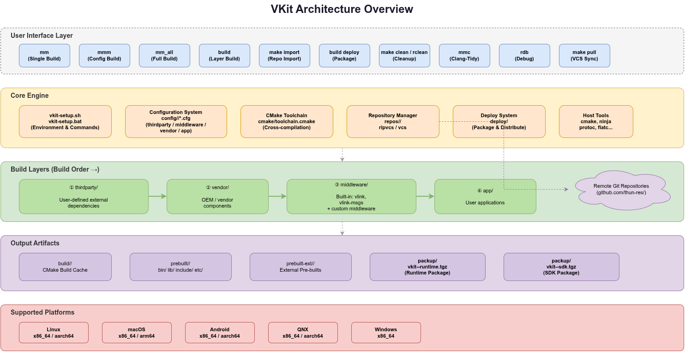
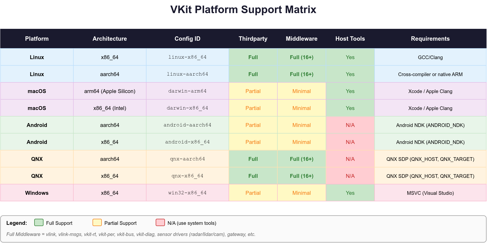
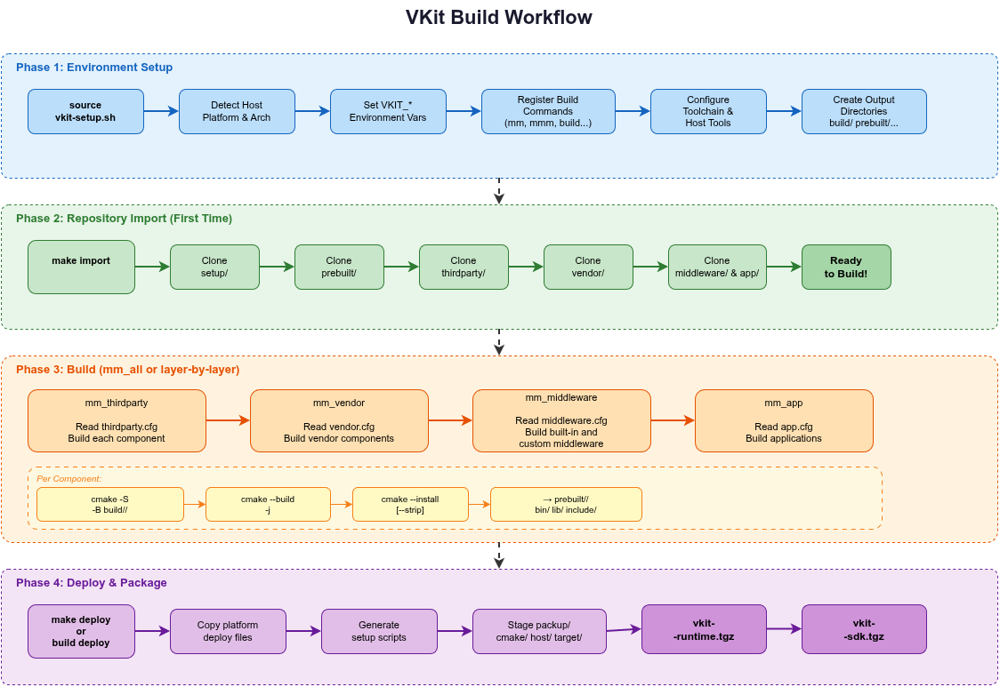
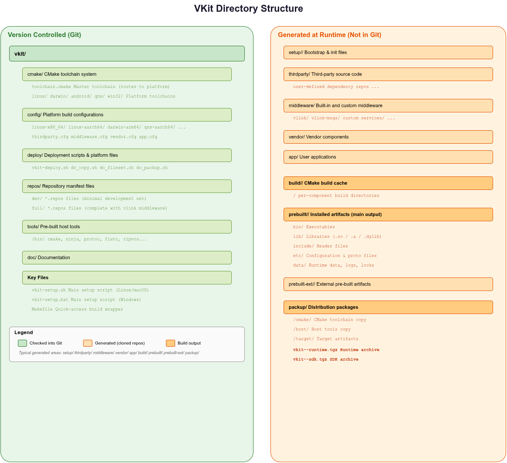

# VKit - Integrated Cross-Platform Build & Package System

<p align="center">
  <strong>A unified build orchestrator and SDK deployment system for multi-platform C/C++ projects</strong>
</p>

<p align="center">
  <em>Similar to vcpkg and Conan, but designed as a complete integrated build ecosystem for the VLink middleware stack</em>
</p>

---

## Overview

VKit is an integrated cross-platform build tool that manages the entire lifecycle of C/C++ software projects: from **repository management** and **dependency building**, through **cross-compilation** and **middleware integration**, to **packaging and SDK deployment**.

Unlike standalone package managers (vcpkg, Conan), VKit provides:

- **Unified environment setup** - One command to configure the entire build environment
- **Layered build system** - Ordered build pipeline: thirdparty → vendor → middleware → app
- **Pre-built host tools** - Bundled cmake, ninja, protoc, flatc, and more
- **Multi-platform cross-compilation** - 9 platform configurations out of the box
- **Repository orchestration** - Manage multiple git repositories as one workspace, including custom import variants
- **SDK & Runtime packaging** - Generate distributable archives with setup scripts



## Supported Platforms

| Platform | Architecture | Config ID |
|----------|-------------|-----------|
| **Linux** | x86_64 | `linux-x86_64` |
| **Linux** | aarch64 | `linux-aarch64` |
| **macOS** | arm64 (Apple Silicon) | `darwin-arm64` |
| **macOS** | x86_64 (Intel) | `darwin-x86_64` |
| **Android** | aarch64 | `android-aarch64` |
| **Android** | x86_64 | `android-x86_64` |
| **QNX** | aarch64 | `qnx-aarch64` |
| **QNX** | x86_64 | `qnx-x86_64` |
| **Windows** | x86_64 | `win32-x86_64` |



## Quick Start

### 1. Clone VKit

```bash
git clone https://github.com/thun-res/vkit.git
cd vkit
```

### 2. Treat the root `Makefile` as the workspace-level entry point

If you are at the repository root and your task is to bring up, rebuild, clean, or package the whole workspace, start with the root `Makefile`.

The easiest way to understand it is by workflow:

**First full workspace bring-up**

```bash
make import full
make install
make deploy
```

**First lightweight bring-up**

```bash
make import dev
make install
```

**Sync and rebuild an existing workspace**

```bash
make pull
make install
```

**Build and package in one step**

```bash
make
```

Equivalent to:

```bash
make install
make deploy
```

Other common forms:

```bash
make deploy_sdk
make clean
make rclean
make dclean
make -j8 install
```

Output archives are generated under `packup/`, for example:

- `packup/vkit-linux-x86_64-runtime.tgz`
- `packup/vkit-linux-x86_64-sdk.tgz`

### 3. Use `source` mode for day-to-day project development

When you need `mm`, `mmm`, and layer-level helpers:

**Linux / macOS**

```bash
source vkit-setup.sh
```

**Windows**

```cmd
vkit-setup.bat
```

After that, the main commands are:

```bash
mm
mmm
mm_all
mm_thirdparty
mm_middleware
mm_app
```

Important:

- `import` is not a VKit shell function after `source`
- `deploy` is not a VKit shell function after `source`
- use `make import full`, `./vkit-setup.sh import full`, `make deploy`, `./vkit-setup.sh deploy`, or `build deploy`

## Build Commands

| Command | Description |
|---------|-------------|
| `mm` | Build current directory project |
| `mmm` | Build project with config flags from .cfg file |
| `mm_thirdparty` | Build all third-party libraries |
| `mm_vendor` | Build all vendor components |
| `mm_middleware` | Build all middleware modules |
| `mm_app` | Build all applications |
| `mm_all` | Build everything (all layers in order) |
| `mmc` | Build with clang-tidy static analysis |
| `make clean` | Clean build artifacts from the repository root |
| `make rclean` | Remove build and packup output more aggressively |
| `make deploy` | Package runtime artifacts from the repository root |
| `make deploy_sdk` | Package SDK with tools and headers |
| `make import dev` / `make import full` | Import a repository profile from the repository root |
| `make pull` | Update all imported repositories |

## Build Workflow



## Directory Structure



**Version controlled:**
```
vkit/
├── cmake/              # CMake toolchain system
├── config/             # Platform build configurations (*.cfg)
├── deploy/             # Deployment & packaging scripts
├── doc/                # Documentation
├── repos/              # Repository manifest files (dev/full)
├── tools/              # Pre-built host tools (cmake, ninja, protoc...)
├── vkit-setup.sh       # Main setup script (Linux/macOS)
├── vkit-setup.bat      # Main setup script (Windows)
└── Makefile            # Quick-access build wrapper
```

**Generated at runtime (not in Git):**
```
vkit/
├── setup/              # Bootstrap files
├── thirdparty/         # Third-party source code
├── middleware/         # VLink and user middleware source
├── vendor/             # Vendor components
├── app/                # User applications
├── build/<platform>/   # CMake build cache
├── prebuilt/<platform>/# Installed artifacts (bin/, lib/, include/)
├── prebuilt-ext/       # External pre-built artifacts
└── packup/             # Distribution packages (.tgz)
```

## Build Layers

VKit organizes projects into four ordered build layers:

| Layer | Directory | Description |
|-------|-----------|-------------|
| **1. thirdparty** | `thirdparty/` | External dependencies, usually treated as support content rather than end-user documentation focus |
| **2. vendor** | `vendor/` | OEM/vendor components |
| **3. middleware** | `middleware/` | Built-in `vlink` and `vlink-msgs`, plus user middleware |
| **4. app** | `app/` | User-created or user-imported applications |

Each layer's components are defined in `config/<platform>/*.cfg` files. Users can freely add their own projects to any layer.

## VLink Integration

VKit is the official build system for the **VLink** middleware ecosystem:

- **vlink** - Core middleware communication framework
- **vlink-msgs** - Protocol message definitions (Protobuf/FlatBuffers)

These are the two built-in middleware projects in the current workspace. Additional middleware projects are user-defined.

## Packaging Output

VKit produces two types of distribution packages:

- **Runtime Package** (`vkit-{VKIT_DEVICE_PLATFORM}-runtime.tgz`) - Executables and shared libraries only
- **SDK Package** (`vkit-{VKIT_DEVICE_PLATFORM}-sdk.tgz`) - Complete SDK with tools, headers, and libraries

Where `{VKIT_DEVICE_PLATFORM}` is the combination of platform and optional device variant (e.g., `linux-x86_64`, `qnx-aarch64-mydevice`).

## Documentation

Detailed documentation (Chinese):

- [Quick Start Guide](doc/getting-started.md) - Environment setup and first build
- [Build Commands Reference](doc/build-commands.md) - All available commands
- [Configuration Guide](doc/configuration.md) - How to write platform config files
- [Creating Your Own Project](doc/create-project.md) - Step-by-step local project and imported repository onboarding tutorial
- [Cross-Compilation Guide](doc/cross-compilation.md) - Building for different platforms
- [Deployment & Packaging](doc/deployment.md) - Creating distributable packages
- [Repository Management](doc/repository-management.md) - Importing your own repositories and defining custom workspace variants
- [Environment Variables](doc/environment-variables.md) - Complete variable reference

## Root `Makefile` Usage

The simplest mental model is:

> the root `Makefile` is the workspace-level VKit entry point.

It is the right tool when you are operating on the whole repository rather than iterating inside one project directory.

### 1. First bring-up

Full workspace:

```bash
make import full
make install
make deploy
```

Lightweight workspace:

```bash
make import dev
make install
```

### 2. Sync and rebuild

```bash
make pull
make install
```

### 3. Packaging

```bash
make deploy
make deploy_sdk
```

If you want build plus packaging in one step:

```bash
make
```

### 4. Clean and rebuild

```bash
make clean
make rclean
make dclean
make aclean
```

### 5. Practical details

- `make` means `install` followed by `deploy`
- `make import full` expands to `./vkit-setup.sh import full`
- `make -j8 install` passes the parallelism into VKit through `MAKEFLAGS`

### 6. When to switch to `source`

Once you enter a specific project directory and want per-project iteration, switch to `source vkit-setup.sh` and use `mm`, `mmm`, and `llcfg`.

## License

Copyright (C) 2026 by Thun Lu. All rights reserved.
